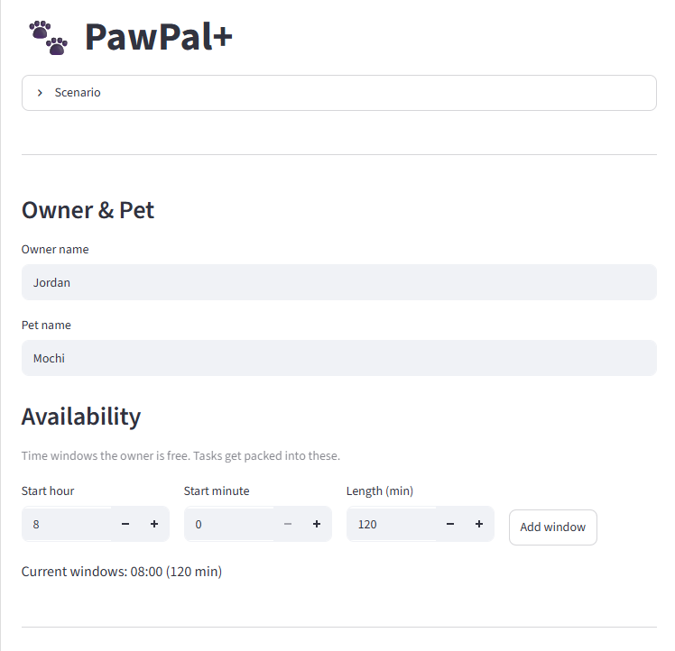
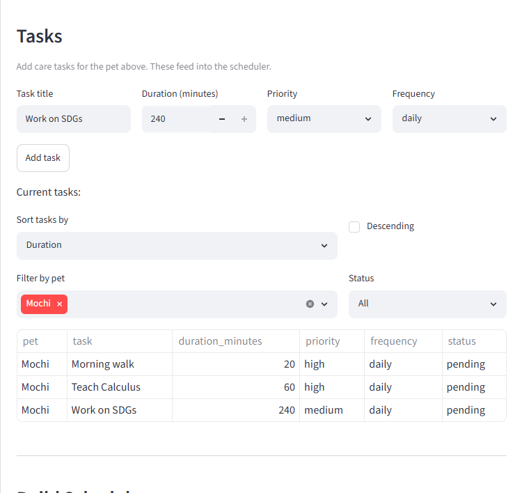
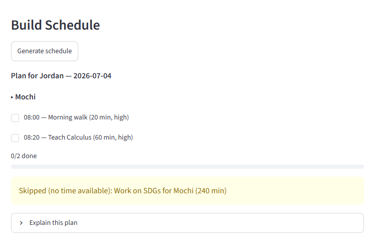

# PawPal+ (Module 2 Project)

You are building **PawPal+**, a Streamlit app that helps a pet owner plan care tasks for their pet.

## Features

- **Priority-first, shortest-duration scheduling** — `Scheduler.generate` packs due tasks by priority (highest first), breaking ties by shortest duration so a quick, important task (like a 5-minute medication) isn't crowded out by a long one of equal priority.
- **Best-fit time placement** — each task is placed into the *tightest* availability window that can still hold it (least leftover room), packing work densely so early tasks don't carve into large windows and strand later ones. A per-window cursor advances as tasks are placed, so tasks never double-book within a single window.
- **Recurrence-aware task selection** — `Scheduler.needs_doing` decides what's due today: `daily` tasks always appear, `weekly` tasks drop off once completed anywhere in the current ISO calendar week, and `once` tasks disappear after they're ever done.
- **Date-keyed completion that persists** — completions are stored on each `Task` keyed by date (`completed_dates`), so regenerating the plan for the same day preserves what's already checked off, and each day is independent (done Tuesday ≠ done Wednesday).
- **Overflow handling** — any task that fits no remaining window is collected into `Schedule.unscheduled` rather than silently dropped, and surfaced in the plan explanation.
- **Conflict detection** — `Schedule.conflicts` / `has_conflicts` flag any two placed tasks whose times overlap (possible when availability windows themselves overlap), reporting them as index pairs; touching slots that merely abut do not count as conflicts.
- **Chronological, explainable plans** — tasks are placed in priority order but reordered by start time for display, and `Schedule.explain` renders a readable, checked-off daily plan with totals, progress (`done/total`), conflicts, and skipped tasks.

## Scenario

A busy pet owner needs help staying consistent with pet care. They want an assistant that can:

- Track pet care tasks (walks, feeding, meds, enrichment, grooming, etc.)
- Consider constraints (time available, priority, owner preferences)
- Produce a daily plan and explain why it chose that plan

Your job is to design the system first (UML), then implement the logic in Python, then connect it to the Streamlit UI.

## What you will build

Your final app should:

- Let a user enter basic owner + pet info
- Let a user add/edit tasks (duration + priority at minimum)
- Generate a daily schedule/plan based on constraints and priorities
- Display the plan clearly (and ideally explain the reasoning)
- Include tests for the most important scheduling behaviors

## Getting started

### Setup

```bash
python -m venv .venv
source .venv/bin/activate  # Windows: .venv\Scripts\activate
pip install -r requirements.txt
```

### Suggested workflow

1. Read the scenario carefully and identify requirements and edge cases.
2. Draft a UML diagram (classes, attributes, methods, relationships).
3. Convert UML into Python class stubs (no logic yet).
4. Implement scheduling logic in small increments.
5. Add tests to verify key behaviors.
6. Connect your logic to the Streamlit UI in `app.py`.
7. Refine UML so it matches what you actually built.

## 🖥️ Sample Output

Paste a sample of your app's CLI or Streamlit output here so a reader can see what a generated plan looks like:

```
Daily plan for Jordan — 2026-07-02
  [x] 08:00 — Morning walk for Mochi (30 min) [priority: 3]
  [x] 08:30 — Feeding for Mochi (10 min) [priority: 3]
  [ ] 08:40 — Feeding for Biscuit (10 min) [priority: 3]
  [ ] 08:50 — Medication for Biscuit (5 min) [priority: 2]
  [ ] 17:30 — Training for Mochi (45 min) [priority: 1]
Total scheduled: 100 min across 5 task(s); 2/5 done.
```

## 🧪 Testing PawPal+

```bash
# Run the full test suite:
pytest

# Run with coverage:
pytest --cov
```

Test output:

```
======================================================================================== test session starts ========================================================================================
platform win32 -- Python 3.14.5, pytest-9.1.1, pluggy-1.6.0
rootdir: C:\Users\t0mbu\Desktop\ai110-module2show-pawpal-starter
plugins: anyio-4.14.1
collected 14 items                                                                                                                                                                                   

tests\test_pawpal.py ..............                                                                                                                                                            [100%]

======================================================================================== 14 passed in 0.03s =========================================================================================
```
My confidence level is probably like a 4 regarding its resilience to breaking.

## 📐 Smarter Scheduling

| Feature | Method(s) | Notes |
|---------|-----------|-------|
| Task sorting | `Scheduler.generate` | Places due tasks by priority (highest first), then shortest duration, then returns them in chronological (start-time) order for display; so important — and quick — tasks claim time first. **Streamlit (`app.py`):** the "Current tasks" list is separately sortable by duration/priority/frequency/pet/title (asc/desc) within the frontend. |
| Filtering | `Scheduler.needs_doing`, `Scheduler.generate` | `needs_doing` drops tasks already satisfied for their period; `generate` sends any task that fits no window to `Schedule.unscheduled`. **Streamlit (`app.py`):** the "Current tasks" list filters by pet and by today's status (All/Pending/Done) are handled within the frontend. |
| Conflict handling | `Scheduler.generate` | Per-window cursors advance as tasks are placed (best-fit), so no two tasks are ever assigned overlapping time. **Streamlit (`app.py`):** duplicate availability windows and same-title/frequency tasks are rejected in the "Add window"/"Add task" handlers. |
| Recurring tasks | `Scheduler.needs_doing`, `Task.done_in_week_of`, `Task.is_done_on` | `daily` always due; `weekly` hidden once `done_in_week_of` the ISO week; `once` hidden after any completion. **Streamlit (`app.py`):** the completion logic is backend (`Task.mark_done_on`), but Streamlit owns the UX — the checkbox wiring and keeping the `Task` objects alive across reruns via `st.session_state`. |

## 📸 Demo Walkthrough

Describe your app in numbered steps so a reader can follow along without watching a video:

1. Enter your name and the name of your pet (unless you happen to be named Jordan with a pet named Mochi, then you can skip this step)
2. Add the times you are available (starting time, length of time)
3. Add the tasks for that particular pet (title, duration, priority, frequency)
4. Repeat for more tasks, or other pets (change the pet name in step 1 before adding a task for another pet)
5. Sort or filter the list of tasks if you want
6. Hit "Generate Schedule"
7. ~~Profit~~

**Screenshot or video** *(optional)*: <!-- Insert a screenshot or link to a demo video here -->


